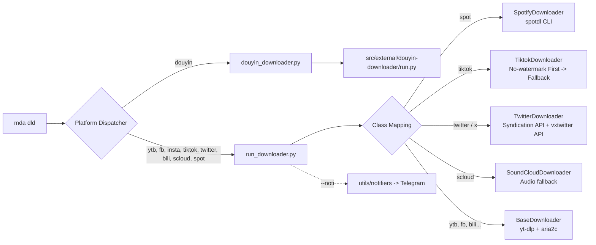

# Media Studio (mda) — Project Context & Architecture Master Guide

> **Mục đích tài liệu:** Đây là tài liệu ngữ cảnh duy nhất và toàn diện về dự án `media-studio`. AI Agent hoặc Developer đọc file này sẽ nắm trọn vẹn bối cảnh, triết lý thiết kế, cấu trúc thư mục, luồng điều phối, logic từng module và các lưu ý kỹ thuật mà không cần phải duyệt qua từng file mã nguồn.

---

## 1. Tổng Quan & Triết Lý Dự Án

### 1.1. Bối cảnh
**Media Studio** là bộ công cụ cá nhân đa năng trên Windows, cung cấp cả giao diện dòng lệnh (**CLI** qua alias `mda`) và giao diện đồ họa (**GUI** qua PySide6) để xử lý các nghiệp vụ media thường gặp:
- Cắt, chia, ghép, trích xuất âm thanh/hình ảnh, xóa watermark/logo trên video.
- Tải media đa nền tảng (YouTube, Facebook, Instagram, TikTok, Twitter/X, Douyin, Bilibili, SoundCloud, Spotify).
- Nhận diện văn bản từ hình ảnh (OCR bằng PaddleOCR).
- Đối chiếu, so sánh video trước/sau xử lý bằng trình phát video kép.
- Tự động hóa tác vụ Git và thông báo trạng thái qua Telegram Bot.

### 1.2. Triết lý thiết kế cốt lõi
1. **Orchestrator / Dispatcher Pattern:** File trung tâm `src/main.py` chỉ làm nhiệm vụ parse tham số, validate và điều phối (dispatch) tới các script con bằng `subprocess`. Logic xử lý thực tế nằm hoàn toàn trong từng module nghiệp vụ (`src/features/*`).
2. **Tận dụng tối đa công cụ chuyên sâu:** Thay vì tự viết lại các thuật toán domain lớn, dự án đóng gói và điều phối các công cụ chuẩn công nghiệp:
   - **FFmpeg & ffprobe:** Xử lý audio/video/media.
   - **yt-dlp & aria2c:** Tải đa nền tảng với cơ chế tăng tốc đa kết nối.
   - **spotDL:** Tải nhạc Spotify thông qua tìm kiếm nguồn audio tương ứng trên YouTube/YouTube Music.
   - **jiji262/douyin-downloader:** Git submodule chuyên sâu vượt anti-bot Douyin, hỗ trợ tải no-watermark và batch profile.
   - **PaddleOCR:** Trích xuất văn bản từ hình ảnh.
   - **Pillow & OpenCV:** Xử lý hình ảnh và frame video.
3. **Hiệu năng cao với Stream Copy:** Các tác vụ cắt/chia media ưu tiên dùng kỹ thuật Stream Copy (`-c copy` trong FFmpeg) để hoàn thành trong vài giây mà không cần encode lại làm suy giảm chất lượng.
4. **Tách biệt dữ liệu và mã nguồn:** Toàn bộ dữ liệu runtime (video, audio, image, cookies, database SQLite) được đặt tại thư mục gốc `data/`, không nằm lẫn trong mã nguồn `src/`.
5. **Self-Documenting CLI:** Dự án có catalog mô tả chi tiết bằng YAML (`src/contents/app_features.yml`) cho phép tra cứu ngay qua cờ `--des`.

---

## 2. Cấu Trúc Thư Mục Toàn Dự Án

```text
media-studio/
├── .env                                # Chứa credentials nhạy cảm (Spotify API, Douyin cookies, Telegram token)
├── .gitignore                          # Cấu hình bỏ qua runtime data, .env, venv, cache
├── ARCHITECTURE.md                     # Tài liệu thiết kế kiến trúc chuẩn của dự án
├── README.md                           # Hướng dẫn cài đặt và sử dụng dành cho người dùng
├── PROJECT_CONTEXT.md                  # [File này] Ngữ cảnh & kiến trúc tổng thể cho AI Agent
├── requirements.txt                    # Danh sách dependency Python chính
├── mda.cmd                             # Windows CMD Batch entry point: gọi python src/main.py %*
├── mda.ps1                             # PowerShell entry point: chuyển tiếp @args chuẩn xác, tránh lỗi tách dấu &
├── ins.cmd                             # Script tiện ích: python -m pip install -r requirements.txt
├── print_project_tree.py               # Script hỗ trợ in cây thư mục dự án
├── project_tree.txt                    # Output cây thư mục dự án
│
├── data/                               # Dữ liệu runtime (Input/Output/Credentials)
│   ├── audio/                          # File âm thanh trích xuất / tải về
│   ├── credentials/                    # File cookie Douyin (.txt) & SQLite db của Douyin downloader
│   ├── image/                          # File ảnh input / output
│   └── video/
│       ├── input/                      # Video nguồn đầu vào
│       └── output/                     # Video kết quả sau xử lý
│
├── doc/                                # Tài liệu kỹ thuật chuyên sâu theo từng tích hợp
│   ├── dld-feature.md                  # Hướng dẫn chi tiết tính năng tải xuống đa nền tảng
│   ├── spotdl-spotify-downloader.md    # Chi tiết tích hợp spotDL và cách xử lý xung đột dependency
│   └── tích hợp douyin downloader tool.md # Tài liệu tích hợp submodule jiji262/douyin-downloader
│
├── issues/
│   └── các vấn đề còn tồn đọng.md     # Danh sách các bài toán cần tối ưu tiếp theo
│
└── src/
    ├── main.py                         # CLI Dispatcher trung tâm (Entry point chính của Python)
    │
    ├── apps/
    │   └── video_player/
    │       └── video_player.py         # GUI PySide6 phát song song 2 video để so sánh input/output
    │
    ├── configs/
    │   ├── paths.py                    # Cấu hình đường dẫn gốc (ROOT_FOLDER_PATH, CONTENTS_FOLDER_PATH)
    │   └── configs.json                # Config JSON mẫu / legacy
    │
    ├── contents/
    │   ├── app_features.yml            # Schema YAML định nghĩa chi tiết tất cả types, actions, flags
    │   └── help.txt                    # Text hiển thị khi gõ mda --help
    │
    ├── external/
    │   └── douyin-downloader/          # Git submodule (jiji262/douyin-downloader) tải Douyin chuyên dụng
    │
    ├── features/                       # Các module nghiệp vụ độc lập
    │   ├── audio/
    │   │   └── extract_audio.py        # Tách âm thanh từ video sang WAV hoặc MP3 bằng FFmpeg
    │   ├── downloader/
    │   │   ├── base_downloader.py      # Lớp BaseDownloader đóng gói yt-dlp + aria2c
    │   │   ├── platform_downloaders.py # Các class kế thừa theo từng nền tảng (YouTube, FB, TikTok, Spotify...)
    │   │   ├── run_downloader.py       # Entry point điều phối chung cho yt-dlp & spotDL
    │   │   ├── douyin_downloader.py    # Wrapper chuyên dụng gọi submodule douyin-downloader
    │   │   └── update_ytdlp.py         # Script tự động nâng cấp yt-dlp lên bản mới nhất
    │   ├── image/
    │   │   ├── flip_image.py           # Lật ảnh ngang/dọc bằng Pillow
    │   │   └── rotate_image.py         # Xoay ảnh theo số độ tùy ý bằng Pillow
    │   ├── media/
    │   │   ├── slice_media.py          # Cắt một đoạn media theo start-end time (Stream copy)
    │   │   ├── part_media_by_size.py   # Chia nhỏ media theo dung lượng MB mục tiêu (Stream copy)
    │   │   └── part_media_by_time.py   # Chia nhỏ media theo thời lượng bằng FFmpeg segment muxer
    │   ├── ocr/
    │   │   └── scan_ocr.py             # Nhận diện chữ trong ảnh bằng PaddleOCR (CPU config fix)
    │   ├── system/
    │   │   ├── _media_studio_git.py    # Tự động hóa: git add . -> git commit -m -> git push
    │   │   └── _print_feature_description.py # In mô tả định dạng màu từ file app_features.yml
    │   └── video/
    │       ├── extract_frames.py       # Trích xuất frames video ra PNG lossless theo chu kỳ thời gian
    │       ├── video_logo_locator.py       # UI chọn vùng logo x1,y1,x2,y2 trên frame tại timestamp
    │       └── video_watermark_remover.py # Xóa watermark/logo theo vùng x1,y1,x2,y2 bằng FFmpeg delogo
    │
    └── utils/
        ├── helpers.py                  # Helper đọc config, làm sạch URL và resolve path
        ├── interactive_cli.py          # Chế độ tương tác REPL và Tab Auto-complete mức thấp qua msvcrt
        └── notifiers/                  # Hệ thống thông báo (Factory pattern)
            ├── __init__.py
            ├── base_notifier.py        # Abstract Base Class cho Notifiers
            ├── notifier_factory.py     # Factory khởi tạo Notifier theo type (vd: telegram)
            └── telegram_notifier.py    # Gửi tin nhắn qua Telegram Bot API (đọc token từ .env)
```

---

## 3. Ngữ Pháp CLI & Cơ Chế Điều Phối (CLI Grammar & Dispatcher)

### 3.1. Cú pháp tổng quát
```bash
mda <type> <action> [value] [extra] [limit] [flags]
```

### 3.2. Bảng ánh xạ Type & Action

| `<type>` | `<action>` | Tham số / Value | Ý nghĩa & Script thực thi |
| :--- | :--- | :--- | :--- |
| `app` | `player` | Không có | Mở GUI Dual Video Player (`src/apps/video_player/video_player.py`). |
| `video` | `locate-logo` | `<input_path> <timestamp>` | Trích 1 frame, mở PySide6 UI để chọn vùng logo và xuất `x1,y1,x2,y2` theo pixel gốc (`src/features/video/video_logo_locator.py`). |
| `video` | `rm-logo` | `<input_path> <x1,y1,x2,y2> [output_path]` | Tự tính `w=x2-x1`, `h=y2-y1`, sau đó xóa logo bằng FFmpeg `delogo` (`src/features/video/video_watermark_remover.py`). |
| `video` | `frames` | `<input_path> <gap_time> [limit]` | Trích xuất frames PNG lossless (vd: `gap_time` = `5s`, `200ms`, `2m`) (`src/features/video/extract_frames.py`). |
| `audio` | `extract` | `<input_path> <output_path>` | Tách audio sang `.wav` hoặc `.mp3` (`src/features/audio/extract_audio.py`). |
| `image` | `flip` | `<input_path> <horizontal\|vertical> [out]` | Lật ảnh bằng Pillow (`src/features/image/flip_image.py`). |
| `image` | `rotate` | `<input_path> <degrees> [output_path]` | Xoay ảnh theo góc độ bằng Pillow (`src/features/image/rotate_image.py`). |
| `media` | `slice` | `<input_path> <start-end> [output_name]` | Cắt đoạn media theo mốc `MM:SS` hoặc `HH:MM:SS` bằng Stream Copy (`src/features/media/slice_media.py`). |
| `media` | `part-size` | `<input_path> <size_mb> [limit]` | Chia media thành các phần theo dung lượng MB (`src/features/media/part_media_by_size.py`). |
| `media` | `part-time` | `<input_path> <duration> [limit]` | Chia media theo thời lượng (vd: `20s`, `3m`) (`src/features/media/part_media_by_time.py`). |
| `ocr` | `scan` | `<input_path> [--output log\|file] [--dest]` | Quét và nhận diện văn bản từ ảnh qua PaddleOCR (`src/features/ocr/scan_ocr.py`). |
| `open` | *(none)* | `[-a]` hoặc `[-f]` | Mở project trong VSCode (mặc định), Antigravity IDE (`-a`) hoặc File Explorer (`-f`). |
| `git` | `commit` | `-m "<message>"` | Chạy chuỗi lệnh staging, commit và push lên GitHub (`src/features/system/_media_studio_git.py`). |
| `dld` | `list` | Không có | Liệt kê danh sách tất cả nền tảng downloader được hỗ trợ. |
| `dld` | `update` | Không có | Tự động nâng cấp `yt-dlp` lên phiên bản mới nhất (`src/features/downloader/update_ytdlp.py`). |
| `dld` | `douyin` | `<url> [--mode] [--folder] [--threads]` | Tải Douyin bằng submodule `jiji262/douyin-downloader` (`src/features/downloader/douyin_downloader.py`). |
| `dld` | `ytb`, `fb`, `insta`, `tiktok`, `spot`, `bili`, `scloud`, `twitter`... | `<url> [option] [flags]` | Tải media đa nền tảng qua `yt-dlp` + `aria2c` hoặc `spotDL` (`src/features/downloader/run_downloader.py`). |

### 3.3. Các cờ (Flags) đáng chú ý
- `--des`: In mô tả chi tiết, cú pháp, tham số và điều kiện của lệnh từ `src/contents/app_features.yml` ra terminal kèm màu sắc.
- `--option <opt>`: Chọn loại/chất lượng tải cho downloader: `good-vid` (mặc định 720p), `best-vid` (gốc cao nhất), `audio`, `sub` (phụ đề SRT/VTT), `thumb` (ảnh bìa), `img` (toàn bộ ảnh trong bài viết).
- `--threads <n>`: Số kết nối song song cho `aria2c` khi tải (mặc định: 4).
- `--format <ext>`: Chỉ định định dạng đầu ra (vd: `mp4`, `mkv`, `mp3`, `wav`, `flac`...). *Có cơ chế auto-detect:* nếu `--format` là audio format nhưng `--option` là video, hệ thống tự động đổi `--option` sang `audio`.
- `--slice <time>`: Cắt đoạn thời gian khi tải (chỉ dùng cho YouTube / YT Music qua `--download-sections`).
- `--mode <mode>`: Dùng riêng cho Douyin batch download: `post`, `like`, `mix`, `music`, `favorites`.
- `--noti [telegram]`: Gửi thông báo kết quả tải (thành công/thất bại) qua Telegram Bot sau khi hoàn thành.
- `-a`, `--anti`: Dùng cho `mda open` để mở bằng Antigravity IDE thay vì VS Code.
- `-f`, `--file_explorer`: Dùng cho `mda open` để mở thư mục dự án trong Windows File Explorer.

---

## 4. Chi Tiết Các Phân Hệ Kỹ Thuật

### 4.1. GUI Dual Video Player (`src/apps/video_player/video_player.py`)
- **Mục đích:** Giao diện so sánh video đối chứng (Side-by-side comparison), chuyên dùng để kiểm tra chất lượng video trước và sau khi xóa watermark hoặc áp dụng filter.
- **Công nghệ:** `PySide6` (Qt 6 QMediaPlayer, QVideoWidget) + `OpenCV` (`extract_thumbnail` lấy frame tại giây thứ 1 làm ảnh đại diện danh sách).
- **Tính năng:**
  - Sidebar bên phải tự động quét thư mục `data/video/input` và `data/video/output`, ghép cặp video theo thứ tự index và hiển thị thumbnail.
  - Điều khiển playback đồng bộ (Space để Play/Pause cả 2, tua ±5s).
  - Quản lý kênh âm thanh linh hoạt: Chỉ nghe kênh Trái (`Ctrl+,`), Chỉ nghe kênh Phải (`Ctrl+.`), Mute/Unmute cả hai (`Ctrl+M`).
  - Hỗ trợ phím tắt toàn diện (`Ctrl+K` mở modal tra cứu phím tắt, `Ctrl+[` / `Ctrl+]` chọn file, `Ctrl++` fullscreen).

### 4.2. Downloader Subsystem (`src/features/downloader/`)
Kiến trúc Downloader gồm 4 thành phần rõ rệt:



1. **`BaseDownloader` (`base_downloader.py`):**
   - Xây dựng lệnh `yt-dlp` chuẩn mực.
   - Tự động gắn cờ tăng tốc `aria2c`: `--external-downloader aria2c --external-downloader-args "aria2c:-x {threads} -s {threads} -k 1M"` (ngoại trừ khi tải `sub`, `thumb`, `img`).
   - Tự động convert/merge định dạng theo `--format`.
   - Bắt lỗi và in hướng dẫn khắc phục thân thiện khi gặp sự cố mạng, link private, giới hạn tuổi hoặc thiếu tool.
2. **`platform_downloaders.py`:**
   - **`TiktokDownloader`:** Ưu tiên tải bản no-watermark bằng format `download_addr-0`. Nếu bị chặn, in cảnh báo và tự động fallback sang cơ chế yt-dlp thông thường.
   - **`TwitterDownloader`:** Thêm `--extractor-args twitter:api=syndication` để tránh lỗi *Bad guest token*. Khi tải ảnh (`--option img`), bóc tách ID tweet và gọi API `https://api.vxtwitter.com/i/status/{id}` để tải ảnh gốc trực tiếp qua `urllib`.
   - **`SoundCloudDownloader`:** Tự động ép chuyển mọi option video về `audio`.
   - **`SpotifyDownloader`:** Không dùng yt-dlp mà chạy lệnh `spotdl download` độc lập. Đọc `SPOTIFY_CLIENT_ID` và `SPOTIFY_CLIENT_SECRET` từ `.env` để tránh bị Spotify chặn Rate Limit 86400s.
3. **`douyin_downloader.py` (Douyin Chuyên Sâu):**
   - Wrapper kết nối trực tiếp với submodule `jiji262/douyin-downloader`.
   - Nhận diện các tham số batch: `--mode post|like|mix|music|favorites`.
   - Đọc các giá trị cookies xác thực Douyin từ `.env` hoặc file trong `data/credentials/`.
4. **`run_downloader.py`:** Entry point khởi tạo đúng class và điều phối gửi thông báo qua `utils.notifiers` khi tải xong hoặc khi gặp lỗi.

### 4.3. Module OCR (`src/features/ocr/scan_ocr.py`)
- Sử dụng thư viện `PaddleOCR` (v2.8.1) cùng `paddlepaddle` (v2.6.2).
- **Cấu hình chống lỗi CPU:** Để chạy ổn định trên CPU mà không bị crash lỗi PIR/MKLDNN của PaddlePaddle 2.6+, script tự động set biến môi trường:
  ```python
  os.environ["FLAGS_enable_pir_api"] = "0"
  os.environ["FLAGS_use_mkldnn"] = "0"
  # Và khởi tạo:
  PaddleOCR(use_textline_orientation=True, lang="en", enable_mkldnn=False)
  ```
- Kết quả OCR có thể xuất trực tiếp ra terminal (`--output log`) hoặc lưu vào file (`--output file --dest <path>`).

### 4.4. Module Media & Audio Stream Copy (`src/features/media/` & `src/features/audio/`)
- **`slice_media.py`:** Cắt đoạn thời gian bằng lệnh `ffmpeg -ss <start> -to <end> -c copy` giúp xử lý tức thời mà không cần encode lại.
- **`part_media_by_size.py`:** Gọi `ffprobe` bóc tách `duration` và `size` thực tế của file, tính toán bitrate trung bình, nhân hệ số an toàn `0.995` rồi cắt thành các phần nhỏ không vượt quá target MB bằng `-c copy`.
- **`part_media_by_time.py`:** Sử dụng FFmpeg Segment Muxer (`-f segment -segment_time <sec> -reset_timestamps 1 -c copy -map 0`) để chia nhỏ file thành từng phần bằng nhau theo thời lượng chỉ định.
- **`extract_audio.py`:** Tách âm thanh sang file WAV PCM (`pcm_s16le`) hoặc MP3 chất lượng cao (`libmp3lame -q:a 2`).

### 4.5. Module Video Processing (`src/features/video/`)
- **`video_logo_locator.py`:** Trích đúng 1 frame tại timestamp qua FFmpeg memory pipe, hiển thị bằng PySide6 và map vùng kéo chuột về native pixel coordinates `x1,y1,x2,y2`.
- **`video_watermark_remover.py`:** CLI nhận `x1,y1,x2,y2`, tự tính `w=x2-x1`, `h=y2-y1`, rồi dùng filter `delogo=x={x}:y={y}:w={w}:h={h}`; encode `libx264 -preset faster -crf 23` và giữ nguyên audio (`-c:a copy`).
- **`extract_frames.py`:** Nhận tham số giãn cách (vd: `5s`, `200ms`, `2m`), tính ra `fps = 1000.0 / gap_ms` và trích xuất ảnh định dạng **PNG lossless** vào thư mục gắn timestamp `{video_stem}--frames--{timestamp}`.

### 4.6. Notifier & Utils (`src/utils/`)
- Áp dụng mô hình **Factory Pattern** (`NotifierFactory.get_notifier(type)`).
- Hiện tại đã hoàn thiện `TelegramNotifier` gửi payload JSON tới endpoint `https://api.telegram.org/bot<TOKEN>/sendMessage` (đọc token và chat ID từ `.env`).

### 4.7. Chế Độ Tương Tác & Auto-Complete (`src/utils/interactive_cli.py`)
- Kích hoạt khi chạy `mda` không kèm tham số.
- Bảng tổng quan hiển thị toàn bộ 9 nhóm `Type` và danh sách `Action` tương ứng.
- **Tab Auto-Complete & Cycle:**
  - Tự động điền và xoay vòng Type theo thứ tự A-Z khi nhấn `[Tab]`.
  - Tự động điền và xoay vòng Action theo Type đã chọn khi nhấn `[Tab]`.
  - Hỗ trợ lọc theo tiền tố (prefix filtering) và bảo toàn các tham số phụ phía sau khi thay đổi action.
- **Bắt phím mức thấp (`msvcrt`):** Đọc phím tức thời trên Windows, xử lý Backspace, Esc, Ctrl+C và tô màu ANSI trực tiếp trên console (`mda > ` prompt). Fallback an toàn khi chạy non-TTY hoặc môi trường khác.
- **Lệnh tiện ích nội bộ session:** `h`/`help`, `types`/`list`, `cls`/`clear`, `q`/`exit`.

---

## 5. Cấu Hình, Bảo Mật & Quản Lý Dữ Liệu

### 5.1. File `.env` (Đặt tại root dự án)
File `.env` chứa toàn bộ thông tin nhạy cảm và **bắt buộc không được commit lên Git**:
```ini
# Telegram Notification (dùng cho cờ --noti telegram)
TELEGRAM_BOT_TOKEN="123456789:ABCdef..."
TELEGRAM_CHAT_ID="987654321"

# Spotify Developer API (dùng cho mda dld spot)
# Đăng ký miễn phí tại: https://developer.spotify.com/dashboard
SPOTIFY_CLIENT_ID="your_spotify_client_id"
SPOTIFY_CLIENT_SECRET="your_spotify_client_secret"

# Douyin Browser Cookies (dùng cho mda dld douyin)
# Lấy từ F12 -> Application -> Storage -> Cookies -> douyin.com
DOUYIN_MS_TOKEN="ms_token_here"
DOUYIN_TTWID="ttwid_here"
DOUYIN_ODIN_TT="odin_tt_here"
DOUYIN_PASSPORT_CSRF_TOKEN="csrf_token_here"
DOUYIN_SID_GUARD="sid_guard_here"
```

### 5.2. Quản lý thư mục dữ liệu `data/`
Mọi file input và output tuân thủ quy ước lưu trữ:
- `data/video/input/`: Chứa các video gốc đầu vào.
- `data/video/output/`: Chứa video kết quả sau khi tải hoặc xử lý.
- `data/audio/`: Chứa file âm thanh trích xuất hoặc bài hát tải về.
- `data/image/`: Chứa hình ảnh lật, xoay hoặc ảnh quét OCR.
- `data/credentials/`: Chứa file cookie backup (.txt) và database lịch sử tải Douyin (`douyin-downloader.db`).

---

## 6. Hướng Dẫn Mở Rộng Tính Năng Cho Developer / AI Agent

Khi cần thêm một action hoặc module mới vào Media Studio, hãy tuân thủ nghiêm ngặt **quy trình 7 bước**:

```text
1. Tạo Script thực thi trong `src/features/<group>/<feature_name>.py`
   -> Đảm bảo script có thể chạy độc lập qua CLI (if __name__ == '__main__': ...).
   -> Sử dụng ensure_utf8_stdout() nếu có in tiếng Việt.

2. Khai báo Constants trong `src/main.py`:
   -> MDIA_<GROUP>_ACTION_<NAME> = "<action-name>"

3. Thêm Handler function trong `src/main.py`:
   -> def run_<feature_name>(...): build command list -> subprocess.run(...) -> sys.exit(0)

4. Thêm nhánh routing vào main() trong `src/main.py`:
   -> elif cmd_type == MDIA_TYPE_<GROUP> and cmd_action == MDIA_<GROUP>_ACTION_<NAME>: ...

5. Cập nhật `src/contents/help.txt`:
   -> Thêm mô tả ngắn gọn và câu lệnh ví dụ.

6. Cập nhật `src/contents/app_features.yml`:
   -> Thêm khối metadata đầy đủ (id, title, command, summary, details, conditions, parameters, flags)
   để lệnh `mda <type> <action> --des` hoạt động chính xác.

7. Cập nhật tài liệu:
   -> Bổ sung vào README.md và ARCHITECTURE.md nếu có thay đổi về cách dùng.
```

---

## 7. Các Lưu Ý Kỹ Thuật Quan Trọng & Vấn Đề Tồn Đọng (Gotchas & Known Issues)

1. **Xung đột Dependency của `spotDL`:**
   - **Tuyệt đối không** thêm `spotdl` vào `requirements.txt` của dự án chính. Cài `spotdl` trực tiếp bằng `pip` sẽ kéo theo `fastapi` và downgrade `anyio` xuống bản cũ, gây phá vỡ môi trường Python chính.
   - **Giải pháp chuẩn:** Cài đặt `spotDL` như một CLI độc lập qua `pipx`:
     ```bash
     python -m pip install --user pipx
     python -m pipx ensurepath
     python -m pipx install spotdl
     ```
2. **Khởi tạo và chạy PaddleOCR:**
   - PaddleOCR v2.8.1 yêu cầu `paddlepaddle==2.6.2`. Trên CPU Windows, nếu không tắt cờ PIR API và MKLDNN trước khi import sẽ gây lỗi crash `ConvertPirAttribute2RuntimeAttribute`. Script `scan_ocr.py` đã chủ động set các flag này.
3. **Cấu hình đường dẫn dự án (`src/configs/paths.py`):**
   - Biến `ROOT_FOLDER_PATH` đang trỏ cứng tới thư mục trên máy hiện tại (`D:/D-Documents/TOOLs/media-studio`). Khi di chuyển dự án sang máy khác, cần cập nhật biến này hoặc tối ưu hóa về đường dẫn động (`Path(__file__).resolve().parent.parent.parent`).
4. **Đồng bộ đường dẫn trong Video Player:**
   - `src/apps/video_player/video_player.py` (dòng 43-44) và `src/configs/configs.json` có tham chiếu cũ tới `src/data/media/`. Dự án đã chuẩn hóa cấu trúc dữ liệu sang `data/video/input` và `data/video/output`.
5. **Git Submodule Douyin:**
   - Khi clone dự án lần đầu trên máy mới, bắt buộc chạy lệnh:
     ```bash
     git submodule update --init --recursive
     ```
     Đồng thời cài đặt Playwright Chromium (`pip install playwright && playwright install chromium`) để hỗ trợ vượt anti-bot Douyin khi API bị giới hạn.
6. **Windows UTF-8 Encoding:**
   - Windows PowerShell/CMD mặc định dùng mã hóa codepage legacy (CP1252 / CP936). Mọi script có in tiếng Việt đều phải gọi hàm `ensure_utf8_stdout()` hoặc `mda.cmd` đã có sẵn lệnh `chcp 65001 >nul`.
