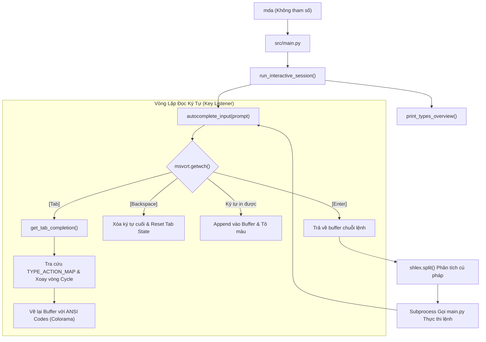

# ⌨️ Tài Liệu Chi Tiết Tính Năng Auto-Complete Trong Media Studio CLI (mda)

Tính năng **Auto-complete (Tự động hoàn thành & Xoay vòng lệnh)** trong Media Studio CLI (`mda`) được tích hợp sâu vào **Chế độ Tương tác (Interactive Mode / REPL)**. Tính năng này giúp người dùng thao tác nhanh chóng, giảm thiểu lỗi chính tả và dễ dàng khám phá toàn bộ hệ sinh thái lệnh của Media Studio mà không cần ghi nhớ từng cú pháp phức tạp.

---

## 📑 Mục Lục
1. [Cách Kích Hoạt Chế Độ Tương Tác](#1-cách-kích-hoạt-chế-độ-tương-tác)
2. [Trải Nghiệm Người Dùng (User Experience)](#2-trải-nghiệm-người-dùng-user-experience)
3. [Kiến Trúc Kỹ Thuật (Architecture)](#3-kiến-trúc-kỹ-thuật-architecture)
4. [Nguyên Lý Hoạt Động Của Thuật Toán Auto-Complete](#4-nguyên-lý-hoạt-động-của-thuật-toán-auto-complete)
5. [Cơ Chế Bắt Phím Mức Thấp (Low-level Key Handling)](#5-cơ-chế-bắt-phím-mức-thấp-low-level-key-handling)
6. [Các Lệnh Tiện Ích Trong Session](#6-các-lệnh-tiện-ích-trong-session)
7. [Quy Chuẩn Đồng Bộ Khi Phát Triển Tính Năng Mới](#7-quy-chuẩn-đồng-bộ-khi-phát-triển-tính-năng-mới)

---

## 1. Cách Kích Hoạt Chế Độ Tương Tác

Để vào chế độ tương tác có hỗ trợ Auto-complete, bạn chỉ cần gõ lệnh `mda` không kèm bất kỳ tham số nào trong terminal:

```powershell
mda
```

Màn hình console sẽ hiển thị bảng tra cứu tổng quan danh sách toàn bộ 9 nhóm lệnh (`Types`) của Media Studio và chuyển sang dấu nhắc lệnh tương tác:

```text
=== DANH SÁCH CÁC NHÓM LỆNH (TYPES) HIỆN CÓ ===
──────────────────────────────────────────────────────────────────────
  app      │ Mở ứng dụng GUI (Trình phát video kép so sánh)
           └── actions: player
  audio    │ Các tính năng xử lý âm thanh (tách audio WAV/MP3)
           └── actions: extract
  dld      │ Tải media đa nền tảng (YouTube, FB, TikTok, Douyin...) & cập nhật
           └── actions: bili, bilibili, bilili, douyin, fb, insta, list, scloud, soundcloud, spot, spotify, tiktok, twitter, update, x, ytb, ytb-music
  git      │ Thao tác tự động hóa Git (commit & push)
           └── actions: commit
  image    │ Các tính năng xử lý hình ảnh (lật ảnh, xoay ảnh)
           └── actions: flip, rotate
  media    │ Xử lý media đa dụng (cắt slice, chia theo size/thời gian)
           └── actions: part-size, part-time, slice
  ocr      │ Nhận diện văn bản từ hình ảnh bằng PaddleOCR
           └── actions: scan
  open     │ Mở thư mục dự án trong IDE (VSCode/Antigravity) hoặc Explorer
           └── actions: (không có action)
  video    │ Các tính năng xử lý video (xóa watermark/logo, trích xuất frames)
           └── actions: frames, rm-logo
──────────────────────────────────────────────────────────────────────
💡 Gợi ý: Nhập 'help' hoặc 'h' để xem toàn bộ tài liệu chi tiết.
          Nhấn [Tab] để tự động điền / xoay vòng Type & Action, nhập 'q' hoặc 'exit' để thoát.

mda > 
```

---

## 2. Trải Nghiệm Người Dùng (User Experience)

### 2.1. Tự động hoàn thành Nhóm lệnh (Type Completion)
- Khi đang ở đầu dòng, bạn gõ một hoặc vài ký tự đầu và nhấn phím **`[Tab]`**.
- Nếu có nhiều `Type` phù hợp, hệ thống sẽ **tự động xoay vòng (cycle)** qua lần lượt các type theo thứ tự bảng chữ cái (A-Z) mỗi khi bạn nhấn tiếp `[Tab]`.

**Ví dụ:**
```text
mda > a[Tab]         -->  mda > app
mda > app[Tab]       -->  mda > audio
mda > audio[Tab]     -->  mda > app (quay lại đầu danh sách khớp)

mda > vi[Tab]        -->  mda > video
mda > gi[Tab]        -->  mda > git
mda > dl[Tab]        -->  mda > dld
```

---

### 2.2. Tự động hoàn thành Hành động (Action Completion)
- Sau khi đã có `Type` và một khoảng trắng, nhấn phím **`[Tab]`** để tự động điền các `Action` của nhóm lệnh đó.
- Nếu gõ một phần của action (vd `mda > dld y` + `[Tab]`), hệ thống chỉ lọc các action bắt đầu bằng chữ `y`.

**Ví dụ:**
```text
mda > video [Tab]       -->  mda > video frames
mda > video frames[Tab] -->  mda > video rm-logo
mda > video rm-logo[Tab]-->  mda > video frames (xoay vòng lại)

# Lọc theo prefix nền tảng tải xuống:
mda > dld y[Tab]        -->  mda > dld ytb
mda > dld ytb[Tab]      -->  mda > dld ytb-music
mda > dld ytb-music[Tab]-->  mda > dld ytb

# Xem danh sách hành động của media:
mda > media [Tab]       -->  mda > media part-size
mda > media part-size[Tab] --> mda > media part-time
mda > media part-time[Tab] --> mda > media slice
```

---

### 2.3. Giữ nguyên tham số bổ sung (Preserve Extra Arguments)
Nếu bạn đã gõ các tham số phía sau (như cờ tùy chọn, đường dẫn file, tham số thời gian) và quay lại đổi action, hệ thống sẽ thay thế đúng vị trí token của action và **giữ nguyên toàn bộ các tham số còn lại**:

**Ví dụ:**
```text
mda > video frames "D:\data\video.mp4" 5s 10
# Nhấn Tab khi con trỏ ở vị trí action -> tự động đổi sang rm-logo nhưng giữ nguyên file và params:
mda > video rm-logo "D:\data\video.mp4" 5s 10
```

---

## 3. Kiến Trúc Kỹ Thuật (Architecture)

Toàn bộ logic tương tác và auto-complete được tổ chức trong module:
📍 **`src/utils/interactive_cli.py`**



### Các thành phần chính trong mã nguồn:
1. **`TYPE_ACTION_MAP` (dict)**: Bảng dữ liệu định nghĩa 9 nhóm `Type` (`app`, `audio`, `dld`, `git`, `image`, `media`, `ocr`, `open`, `video`) cùng danh sách toàn bộ các `Action` tương ứng (sắp xếp A-Z).
2. **`TYPE_DESCRIPTIONS` (dict)**: Tóm tắt 1 dòng mục đích sử dụng cho từng `Type`.
3. **`get_tab_completion()`**: Hàm thuần logic tính toán chuỗi gợi ý tiếp theo dựa trên buffer hiện tại, trạng thái tab trước đó (`last_was_tab`) và chỉ số xoay vòng (`cycle_idx`).
4. **`autocomplete_input()`**: Hàm bắt sự kiện bàn phím mức thấp trên Windows (`msvcrt`), điều khiển buffer, tô màu ANSI và cập nhật giao diện console. Hỗ trợ kiểm tra `sys.stdin.isatty()` để tương thích tốt cả trong môi trường non-TTY.
5. **`run_interactive_session()`**: REPL controller quản lý vòng đời phiên làm việc, phân tách lệnh bằng `shlex`, tự động bóc tách từ khóa `mda` thừa và gọi subprocess thực thi an toàn mà không làm sập session khi gặp lỗi hoặc hủy lệnh.

---

## 4. Nguyên Lý Hoạt Động Của Thuật Toán Auto-Complete

Hàm `get_tab_completion(buffer, last_was_tab, original_prefix, cycle_idx)` phân tích trạng thái dòng lệnh theo 2 ngữ cảnh:

```python
# Pseudo-code logic của get_tab_completion trong Media Studio
if " " not in buffer:
    # NGỮ CẢNH 1: Đang ở Token 0 (Nhóm lệnh - Type)
    cleaned_buf = buffer.strip().lower()
    if not last_was_tab:
        if cleaned_buf in sorted_types:
            # Nếu đã là 1 type hợp lệ, xoay vòng sang type kế tiếp
            original_prefix = ""
            candidates = sorted_types
            cycle_idx = (sorted_types.index(cleaned_buf) + 1) % len(sorted_types)
            return candidates[cycle_idx], original_prefix, cycle_idx, True
        else:
            original_prefix = cleaned_buf
            cycle_idx = 0
    else:
        cycle_idx += 1

    candidates = [t for t in sorted_types if t.startswith(original_prefix)]
    cycle_idx = cycle_idx % len(candidates)
    return candidates[cycle_idx], original_prefix, cycle_idx, True

else:
    # NGỮ CẢNH 2: Đã có Type -> Đang ở Token 1 (Hành động - Action) hoặc các tham số sau
    parts = buffer.split(" ")
    cmd_type = parts[0].strip().lower()
    valid_actions = sorted(TYPE_ACTION_MAP.get(cmd_type, []))
    action_part = parts[1].strip().lower() if len(parts) > 1 else ""
    rest_of_args = (" " + " ".join(parts[2:])) if len(parts) > 2 else ""

    if not last_was_tab:
        if action_part in valid_actions:
            # Nếu đã là 1 action hợp lệ, xoay vòng sang action kế tiếp
            original_prefix = ""
            candidates = valid_actions
            cycle_idx = (valid_actions.index(action_part) + 1) % len(valid_actions)
            return f"{cmd_type} {candidates[cycle_idx]}{rest_of_args}", original_prefix, cycle_idx, True
        else:
            original_prefix = action_part
            cycle_idx = 0
    else:
        cycle_idx += 1

    candidates = [a for a in valid_actions if a.startswith(original_prefix)]
    cycle_idx = cycle_idx % len(candidates)
    return f"{cmd_type} {candidates[cycle_idx]}{rest_of_args}", original_prefix, cycle_idx, True
```

### Điểm nổi bật của thuật toán:
- **Stateful Cycling**: Lưu vết `original_prefix` ban đầu khi người dùng gõ. Nhờ vậy, khi nhấn Tab liên tục (ví dụ gõ `y` rồi ấn Tab 3 lần), prefix tìm kiếm vẫn là `y` chứ không bị biến thành từ khóa hoàn chỉnh của lần nhấn trước.
- **Modulo Wrap-around**: Khi duyệt đến ứng viên cuối cùng trong danh sách candidates, lần nhấn Tab tiếp theo sẽ quay trở lại ứng viên đầu tiên (`(cycle_idx + 1) % len(candidates)`).
- **Tự động chuyển tiếp thông minh**: Khi một action đã được điền hoàn chỉnh, nhấn tiếp Tab sẽ mượt mà xoay vòng sang action kế tiếp trong cùng nhóm lệnh.

---

## 5. Cơ Chế Bắt Phím Mức Thấp (Low-level Key Handling)

Trên hệ điều hành Windows, hàm `input()` mặc định của Python hoạt động theo cơ chế **Line-buffered I/O** (chỉ trả về kết quả khi bấm Enter và nuốt mất phím Tab).

Để giải quyết vấn đề này, Media Studio sử dụng thư viện chuẩn **`msvcrt`** (Microsoft Visual C Runtime):

| Phím bấm / Mã Hex | Cách xử lý trong Media Studio CLI |
| :--- | :--- |
| **`\t`** hoặc **`\x09`** (Tab) | Kích hoạt Auto-complete / Cycle candidates. |
| **`\r`** hoặc **`\n`** (Enter) | Kết thúc nhập liệu, trả về buffer cho dispatcher thực thi. |
| **`\x08`** hoặc **`\x7f`** (Backspace) | Xóa 1 ký tự khỏi buffer, gửi mã escape `\r\033[K` để xóa dòng và vẽ lại buffer ngay lập tức. |
| **`\x03`** (Ctrl+C), **`\x04`** (Ctrl+D) | Thoát phiên làm việc tương tác một cách an toàn. |
| **`\x1b`** (Esc) | Xóa sạch buffer dòng lệnh hiện tại (hoặc thoát session nếu dòng đang rỗng). |
| **`\x00`**, **`\xe0`** (Arrow keys / F-keys) | Nuốt mã scan code thứ 2 để tránh rác ký tự điều hướng vào buffer. |
| **Màu sắc ANSI** | Sử dụng escape sequence kết hợp `colorama` để tô màu trực quan: Prompt `mda > ` màu cam/cyan, Type màu xanh lá (`green`), Action màu xanh dương nhạt (`cyan`), tham số màu trắng (`white`). |

> [!NOTE]
> **Khả năng tương thích nền tảng:**
> Nếu chạy trên các môi trường không phải Windows hoặc khi `sys.stdin.isatty()` là False (ví dụ qua pipeline hoặc script tự động), hàm tự động fallback an toàn sang `input()` tiêu chuẩn của Python để không gây crash ứng dụng.

---

## 6. Các Lệnh Tiện Ích Trong Session

Khi đang ở trong phiên làm việc tương tác `mda > `, bạn có thể sử dụng các lệnh tắt sau:

| Lệnh | Ý nghĩa |
| :--- | :--- |
| `h` hoặc `help` | Hiển thị toàn bộ tài liệu trợ giúp chi tiết (`help.txt`). |
| `type`, `types`, `list`, `ls` | In lại bảng tổng quan danh mục Type và Action. |
| `cls`, `clear` | Xóa màn hình terminal và in lại bảng gợi ý. |
| `q`, `quit`, `exit` | Thoát khỏi phiên làm việc tương tác. |
| `<cmd> --des` | Xem mô tả chi tiết, cú pháp và điều kiện thực thi của lệnh đó. |
| Gõ `mda <cmd>` | Hệ thống tự động nhận diện và loại bỏ từ khóa `mda` thừa nếu bạn lỡ tay gõ đầy đủ (vd: `mda dld update` -> tự chạy `dld update`). |

---

## 7. Quy Chuẩn Đồng Bộ Khi Phát Triển Tính Năng Mới

Mỗi khi bạn thêm, sửa hoặc xóa tính năng trong Media Studio:
1. **Thêm một nhóm lệnh mới (`Type`)**: Phải khai báo vào `TYPE_ACTION_MAP` và `TYPE_DESCRIPTIONS` trong `src/utils/interactive_cli.py`.
2. **Thêm/Sửa/Xóa một hành động (`Action`)**: Phải cập nhật danh sách mảng của Type đó trong `TYPE_ACTION_MAP` (luôn giữ thứ tự **sắp xếp A-Z**).

### Ví dụ khi thêm action `update` vào type `dld`:
```python
# Trong src/utils/interactive_cli.py
TYPE_ACTION_MAP = {
    # ...
    "dld": [
        "bili",
        "bilibili",
        "bilili",
        "douyin",
        "fb",
        "insta",
        "list",
        "scloud",
        "soundcloud",
        "spot",
        "spotify",
        "tiktok",
        "twitter",
        "update",
        "x",
        "ytb",
        "ytb-music",
    ],
    # ...
}
```

Việc này đảm bảo tính năng **Tab Auto-complete** luôn hoạt động chính xác và đồng bộ 100% với các tài liệu `help.txt`, `app_features.yml`, `PROJECT_CONTEXT.md` và bộ định tuyến `src/main.py`.
