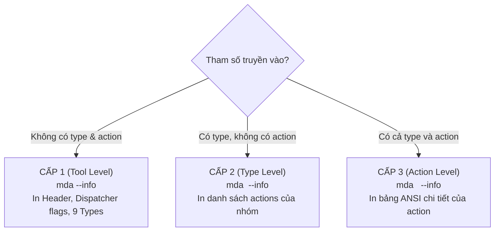

# 📖 Tài Liệu Chi Tiết Tính Năng `--info` Trong Media Studio CLI (`mda`)

Tài liệu này mô tả toàn diện kiến trúc kỹ thuật, luồng xử lý dữ liệu, thuật toán so khớp lệnh và cơ chế hiển thị định dạng đầu ra của tính năng **Self-Documenting CLI (`--info`)** trong hệ thống **Media Studio CLI (`mda`)**.

---

## 📑 Mục Lục
1. [Tổng Quan & Triết Lý Thiết Kế](#1-tổng-quan--triết-lý-thiết-kế)
2. [Cấu Trúc Catalog Dữ Liệu (`app_features.yml`)](#2-cấu-trúc-catalog-dữ-liệu-app_featuresyml)
3. [Cơ Chế Bóc Tách Cờ Sớm Tại Central Dispatcher (`src/main.py`)](#3-cơ-chế-bóc-tách-cờ-sớm-tại-central-dispatcher-srcmainpy)
4. [Cách In Ra Mô Tả Theo 3 Cấp Độ (3-Level Output)](#4-cách-in-ra-mô-tả-theo-3-cấp-độ-3-level-output)
   - [4.1. Cấp 1: Tra cứu Toàn Cục (`mda --info`)](#41-cấp-1-tra-cứu-toàn-cục-mda---info)
   - [4.2. Cấp 2: Tra cứu Cấp Nhóm Lệnh (`mda <type> --info`)](#42-cấp-2-tra-cứu-cấp-nhóm-lệnh-mda-type---info)
   - [4.3. Cấp 3: Tra cứu Cấp Hành Động Cụ Thể (`mda <type> <action> --info`)](#43-cấp-3-tra-cứu-cấp-hành-động-cụ-thể-mda-type-action---info)
5. [Động Cơ Hiển Thị & Bảng Màu ANSI (`_print_feature_description.py`)](#5-động-cơ-hiển-thị--bảng-màu-ansi-_print_feature_descriptionpy)
   - [5.1. Định dạng bảng ANSI chuẩn](#51-định-dạng-bảng-ansi-chuẩn)
   - [5.2. Hỗ trợ tài liệu Markdown mở rộng (`raw_file` / `raw_text`)](#52-hỗ-trợ-tài-liệu-markdown-mở-rộng-raw_file--raw_text)
   - [5.3. Xử lý cảnh báo an toàn (`Exit Code 0`)](#53-xử-lý-cảnh-báo-an-toàn-exit-code-0)
6. [Thuật Toán So Khớp Lệnh (`is_command_match`)](#6-thuật-toán-so-khớp-lệnh-is_command_match)
7. [Bảng Lệnh Mẫu Tra Cứu Thực Tế](#7-bảng-lệnh-mẫu-tra-cứu-thực-tế)
8. [Quy Chuẩn Đồng Bộ Khi Thêm Tính Năng Mới (Developer SOP)](#8-quy-chuẩn-đồng-bộ-khi-thêm-tính-năng-mới-developer-sop)

---

## 1. Tổng Quan & Triết Lý Thiết Kế

Trong các công cụ CLI xử lý đa phương tiện phức tạp, người dùng thường gặp khó khăn khi phải ghi nhớ nhiều cờ tùy chọn, định dạng tham số (tọa độ pixel, mốc thời gian, bitrate, preset...). 

Tính năng **`--info`** được xây dựng theo triết lý **Self-Documenting CLI (Tự làm tài liệu)**:
* **Tra cứu nội dòng tức thì:** Cho phép xem hướng dẫn chi tiết của từng lệnh ngay trong terminal mà không cần mở trình duyệt hay đọc mã nguồn.
* **Chặn thực thi an toàn (Non-execution Guarantee):** Khi cờ `--info` xuất hiện, hệ thống **tuyệt đối không chạy logic nghiệp vụ** (không encode video, không tải mạng, không chạy OCR).
* **Vị trí tự do (Position-Agnostic):** Cờ `--info` có thể đặt ở bất kỳ đâu trong câu lệnh (đầu, giữa các tham số, hoặc cuối cùng).
* **Tương thích ngược 100%:** Hỗ trợ alias `--des` ngầm cho các kịch bản hoặc thói quen cũ.

```mermaid
flowchart LR
    UserInput["mda <type> <action> [params] --info"] --> Dispatcher["Central Dispatcher (src/main.py)"]
    Dispatcher -->|Phát hiện --info / --des| Extractor["Bóc tách cmd_type & cmd_action"]
    Extractor --> Engine["Feature Description Engine (_print_feature_description.py)"]
    Engine --> Catalog[("src/contents/app_features.yml")]
    Catalog --> Formatter["Định Dạng ANSI Table / Raw Markdown"]
    Formatter --> Terminal["In ra Terminal & Exit(0)"]
```



---

## 2. Cấu Trúc Catalog Dữ Liệu (`app_features.yml`)

Dữ liệu mô tả tính năng được quản lý tập trung tại file YAML duy nhất:
📍 **[`src/contents/app_features.yml`](file:///d:/D-Documents/TOOLs/media-studio/src/contents/app_features.yml)**

### Cấu trúc Schema chuẩn:
```yaml
mdia_tool:
  # 1. Danh sách các cờ điều phối toàn cục (Dispatcher Flags)
  dispatcher_flags:
    - flag: "--info"
      description: "In mô tả chi tiết của lệnh từ app_features.yml (không thực thi lệnh)."
    - flag: "-a / --anti"
      description: "Dùng Antigravity IDE thay vì VSCode khi mở dự án."
    - flag: "-f / --file_explorer"
      description: "Mở thư mục dự án trong Windows File Explorer."
    - flag: "-h / --help"
      description: "In toàn bộ hướng dẫn sử dụng ra terminal."

  # 2. Danh mục 9 nhóm lệnh (Types) và các hành động (Actions)
  types:
    - name: "video"
      description: "Các tính năng xử lý video (Xóa logo/watermark, trích frames)"
      actions:
        - id: "ACTION 02"
          title: "Xóa Watermark/Logo"
          command: "mda video rm-logo <input_path> <x1,y1,x2,y2> [output_path]"
          summary: "Tự động xóa watermark/logo khỏi video theo vùng tọa độ chỉ định bằng FFmpeg delogo."
          details: "Chạy script video_watermark_remover.py. Nhận hai góc (x1,y1) và (x2,y2), tự tính w, h rồi áp dụng filter delogo."
          parameters: "<input_path>: Video đầu vào. <x1,y1,x2,y2>: Tọa độ hai góc vùng cần xóa. [output_path]: Tùy chọn đường dẫn đầu ra."
          flags: "Không có flags tùy chọn."
          conditions: "input_path và bộ tọa độ là bắt buộc. x2 > x1, y2 > y1. Yêu cầu FFmpeg."
```

### Các trường dữ liệu trong từng Action:
| Trường | Bắt buộc | Ý nghĩa |
| :--- | :---: | :--- |
| `id` | Có | Mã định danh chuẩn hóa (ví dụ: `ACTION 02`, `ACTION 06b`...). |
| `title` | Có | Tiêu đề tính năng ngắn gọn. |
| `command` | Có | Cú pháp câu lệnh mẫu (dùng `\|` để ngăn cách các alias). |
| `summary` | Có | Tóm tắt 1-2 câu về công dụng của lệnh. |
| `details` | Có | Giải thích sâu về cơ chế kỹ thuật (thuật toán, filter FFmpeg, thư viện sử dụng). |
| `parameters` | Tùy chọn | Mô tả từng tham số vị trí (`<bắt_buộc>`, `[tùy_chọn]`). |
| `flags` | Tùy chọn | Mô tả các cờ tùy chọn bổ sung (ví dụ: `--threads`, `--output`...). |
| `conditions` | Tùy chọn | Điều kiện tiên quyết (yêu cầu file, thư viện, GPU, PATH...). |
| `raw_file` | Tùy chọn | Đường dẫn file Markdown mở rộng để in trực tiếp (nếu có). |
| `raw_text` | Tùy chọn | Khối văn bản thô đa dòng thay thế cho bảng ANSI. |

---

## 3. Cơ Chế Bóc Tách Cờ Sớm Tại Central Dispatcher (`src/main.py`)

Trong [`src/main.py`](file:///d:/D-Documents/TOOLs/media-studio/src/main.py), hàm `main()` tiến hành bóc tách cờ `--info` và `--des` ngay khi vừa nhận `sys.argv[1:]`:

```python
def main():
    ensure_utf8_stdout()
    raw_args = sys.argv[1:]

    # 1. Bóc tách Dispatcher Flags toàn cục trước
    info_flag = False
    feature_args = []

    for arg in raw_args:
        if arg in ("--info", "--des"):
            info_flag = True
        else:
            feature_args.append(arg)

    # 2. Xử lý tra cứu mô tả qua --info / --des (vị trí tự do)
    if info_flag:
        pos_args = [a for a in feature_args if not a.startswith("-")]
        cmd_type = pos_args[0] if len(pos_args) > 0 else None
        cmd_action = pos_args[1] if len(pos_args) > 1 else None

        script_path = get_script_path("features/system/_print_feature_description.py")
        run_cmd = [sys.executable, script_path]
        if cmd_type:
            run_cmd.extend(["--type", cmd_type])
        if cmd_action:
            run_cmd.extend(["--action", cmd_action])

        subprocess.run(run_cmd)
        sys.exit(0)  # Dừng ngay lập tức, không chạy logic nghiệp vụ
```

### Ưu điểm của giải pháp:
1. **Position-Agnostic:** Dù người dùng gõ `mda --info video rm-logo "input.mp4"` hay `mda video rm-logo "input.mp4" --info`, danh sách `pos_args` vẫn trích xuất chính xác `cmd_type = "video"` và `cmd_action = "rm-logo"`.
2. **Ngắt luồng an toàn:** Thực hiện `sys.exit(0)` ngay sau khi in thông tin, bảo đảm các tác vụ nặng không bao giờ bị kích hoạt nhầm.

---

## 4. Cách In Ra Mô Tả Theo 3 Cấp Độ (3-Level Output)

Động cơ [`_print_feature_description.py`](file:///d:/D-Documents/TOOLs/media-studio/src/features/system/_print_feature_description.py) hỗ trợ tra cứu thông minh theo 3 cấp độ:



---

### 4.1. Cấp 1: Tra cứu Toàn Cục (`mda --info`)
* **Lệnh kích hoạt:** `mda --info`
* **Nội dung hiển thị:**
  1. Header biểu ngữ Media Studio CLI.
  2. Cú pháp chung và hướng dẫn vào chế độ tương tác.
  3. Bảng danh sách các cờ điều phối toàn cục (`dispatcher_flags`).
  4. Danh sách toàn bộ 9 nhóm lệnh (`Types`) kèm tóm tắt mục đích.
  5. Dòng gợi ý cú pháp tra cứu cấp sâu hơn.

#### Mẫu đầu ra trên Terminal:
```text
==================================================================
🚀 Media Studio CLI (mda) — Bộ Công Cụ Xử Lý Media Đa Năng
==================================================================
+) Cú pháp chung: mda <type> <action> [tham_số...] [flags]
+) Chế độ tương tác: Chạy 'mda' không tham số để vào REPL + Tab Autocomplete.

Các cờ điều phối toàn cục (Dispatcher Flags):
  --info                 : In mô tả chi tiết của lệnh từ app_features.yml (không thực thi lệnh).
  -a / --anti            : Dùng Antigravity IDE thay vì VSCode khi mở dự án.
  -f / --file_explorer   : Mở thư mục dự án trong Windows File Explorer.
  -h / --help            : In toàn bộ hướng dẫn sử dụng ra terminal.

Danh sách nhóm lệnh (Types):
  open       : Mở project trong IDE (VSCode / Antigravity) hoặc File Explorer
  app        : Ứng dụng GUI (Trình phát video kép đối chiếu)
  video      : Các tính năng xử lý video (Xóa logo/watermark, trích frames)
  audio      : Các tính năng xử lý âm thanh
  image      : Các tính năng xử lý hình ảnh (Lật ảnh, xoay ảnh)
  media      : Các tính năng xử lý media đa dụng (Cắt slice, chia theo dung lượng / thời lượng)
  ocr        : Nhận diện văn bản từ hình ảnh (PaddleOCR)
  git        : Thao tác tự động hóa Git
  dld        : Các tính năng tải xuống Media đa nền tảng (Downloader)

💡 Tra cứu chi tiết: Gõ mda <type> --info hoặc mda <type> <action> --info
==================================================================
```

---

### 4.2. Cấp 2: Tra cứu Cấp Nhóm Lệnh (`mda <type> --info`)
* **Lệnh kích hoạt:** `mda video --info`, `mda dld --info`, `mda media --info`...
* **Nội dung hiển thị:**
  - Header tiêu đề nhóm lệnh kèm mô tả nhóm.
  - Liệt kê toàn bộ các action thuộc nhóm: Tên tính năng, Lệnh thực thi mẫu, Tóm tắt công dụng.
  - Gợi ý câu lệnh tra cứu chi tiết từng action (`mda <type> <action> --info`).
  - *(Đặc biệt: Nếu nhóm lệnh chỉ có đúng 1 action duy nhất như `mda open --info`, hệ thống sẽ tự động in chi tiết action đó).*

#### Mẫu đầu ra trên Terminal (Ví dụ `mda dld --info`):
```text
=== NHÓM LỆNH: DLD (Các tính năng tải xuống Media đa nền tảng (Downloader)) ===
──────────────────────────────────────────────────────────────────────
  • Tải Video / Audio từ mạng xã hội
    Lệnh:    mda dld <platform> <url> | mda dld ytb | mda dld ytb-music | mda dld fb | mda dld insta | mda dld tiktok | mda dld twitter | mda dld x | mda dld douyin | mda dld bilibili | mda dld bili | mda dld bilili | mda dld soundcloud | mda dld scloud | mda dld spot | mda dld spotify
    Tóm tắt: Tải video, audio hoặc phụ đề đa nền tảng. YouTube/YT Music/Facebook/Instagram/TikTok/Twitter/Bilibili/SoundCloud dùng yt-dlp + aria2c. Spotify dùng spotDL (chỉ audio). Douyin dùng jiji262/douyin-downloader (no-watermark, hỗ trợ batch profile).

  • Liệt kê danh sách nền tảng được hỗ trợ
    Lệnh:    mda dld list
    Tóm tắt: In ra danh sách các nền tảng và các alias hỗ trợ cho lệnh mda dld.

  • Cập nhật yt-dlp lên bản mới nhất
    Lệnh:    mda dld update
    Tóm tắt: Tự động nâng cấp gói yt-dlp lên phiên bản mới nhất từ PyPI.

💡 Xem chi tiết từng lệnh: Gõ mda dld <action> --info
──────────────────────────────────────────────────────────────────────
```

---

### 4.3. Cấp 3: Tra cứu Cấp Hành Động Cụ Thể (`mda <type> <action> --info`)
* **Lệnh kích hoạt:** `mda video rm-logo --info`, `mda media slice --info`, `mda ocr scan --info`, `mda dld spot --info`...
* **Nội dung hiển thị:**
  - Tiêu đề tính năng kèm mã `[ACTION ID]`.
  - Cú pháp lệnh chính xác (`+) Lệnh:`).
  - Tóm tắt công dụng (`+) Tóm tắt:`).
  - Cơ chế kỹ thuật chi tiết (`+) Chi tiết:`).
  - Giải thích từng tham số bắt buộc / tùy chọn (`+) Tham số:`).
  - Danh sách cờ bổ sung (`+) Flags:`).
  - Yêu cầu môi trường & điều kiện tiên quyết (`+) Điều kiện:`).

#### Mẫu đầu ra trên Terminal (Ví dụ `mda ocr scan --info`):
```text
--- Tính năng: Quét và nhận diện chữ trong ảnh [ACTION 06b] ---
+) Lệnh:	mda ocr scan <input_path> [--output log|file] [--dest <path>]
+) Tóm tắt:	Nhận diện toàn bộ văn bản trong file ảnh bằng PaddleOCR và xuất ra terminal hoặc file text.
+) Chi tiết:	Chạy script scan_ocr.py. Tự động cấu hình tắt PIR API và MKLDNN để vận hành ổn định trên CPU mà không bị crash lỗi PaddlePaddle.
+) Tham số:	<input_path>: Đường dẫn ảnh cần quét chữ.
+) Flags:	--output log|file: Xuất kết quả ra log terminal hoặc lưu vào file text (mặc định: log). /// --dest <path>: Đường dẫn file text đích nếu chọn --output file.
+) Điều kiện:	Yêu cầu paddlepaddle==2.6.2 và paddleocr==2.8.1.
```

---

## 5. Động Cơ Hiển Thị & Bảng Màu ANSI (`_print_feature_description.py`)

### 5.1. Định dạng bảng ANSI chuẩn
Hàm `render_action_block(action: dict)` sử dụng bảng mã màu ANSI để định dạng thông tin trực quan:

| Mục hiển thị | Mã ANSI / Màu sắc | Ý nghĩa |
| :--- | :--- | :--- |
| **Tiêu đề tính năng** | `\033[36;1m` (Cyan Bold) | Nổi bật tiêu đề và ID tính năng. |
| **Nhãn `+) Lệnh / Tóm tắt / Chi tiết...`** | `\033[32;1m` (Green Bold) | Phân tách rõ ràng các đầu mục. |
| **Cú pháp lệnh** | `\033[33m` (Yellow) | Giúp người dùng dễ dàng copy/paste lệnh. |
| **Nội dung tóm tắt & tham số** | `\033[97m` (White) | Rõ ràng, dễ đọc trên nền terminal tối. |
| **Giải thích chi tiết & Điều kiện** | `\033[2m` (Dim / Gray) | Giảm độ chói cho các đoạn giải thích kỹ thuật dài. |

```python
def render_action_block(action: dict):
    title = action.get("title", "Không có tiêu đề")
    act_id = action.get("id", "")
    id_badge = f" [{act_id}]" if act_id else ""

    print()
    print(f"{CYAN_BOLD}--- Tính năng: {title}{id_badge} ---{RESET}")
    print(f"{GREEN_BOLD}+) Lệnh:{RESET}\t{YELLOW}{action.get('command', 'Không có')}{RESET}")
    print(f"{GREEN_BOLD}+) Tóm tắt:{RESET}\t{WHITE}{action.get('summary', 'Không có')}{RESET}")
    print(f"{GREEN_BOLD}+) Chi tiết:{RESET}\t{DIM}{action.get('details', 'Không có')}{RESET}")

    if action.get("parameters"):
        print(f"{GREEN_BOLD}+) Tham số:{RESET}\t{WHITE}{action.get('parameters')}{RESET}")
    if action.get("flags"):
        print(f"{GREEN_BOLD}+) Flags:{RESET}\t{WHITE}{action.get('flags')}{RESET}")
    if action.get("conditions"):
        print(f"{GREEN_BOLD}+) Điều kiện:{RESET}\t{DIM}{action.get('conditions')}{RESET}")
    print()
```

---

### 5.2. Hỗ trợ tài liệu Markdown mở rộng (`raw_file` / `raw_text`)
Đối với các tính năng có tài liệu tích hợp chuyên sâu (ví dụ hướng dẫn cấu hình Cookies Douyin, Spotify API), schema YAML cho phép khai báo trường `raw_file`:

```python
    # Kiểm tra raw_file
    raw_file = action.get("raw_file")
    if raw_file:
        candidate_paths = [
            Path(ROOT_FOLDER_PATH) / raw_file if ROOT_FOLDER_PATH else None,
            Path(src_dir) / raw_file,
            Path(src_dir).parent / raw_file,
            Path(raw_file),
        ]
        for cp in candidate_paths:
            if cp and cp.is_file():
                with open(cp, "r", encoding="utf-8", errors="replace") as f:
                    print(f"\n{f.read().strip()}\n")
                return
```
Khi có `raw_file`, toàn bộ nội dung file Markdown sẽ được in trực tiếp ra terminal một cách nguyên vẹn.

---

### 5.3. Xử lý cảnh báo an toàn (`Exit Code 0`)
Nếu người dùng gõ nhầm một type hoặc action không tồn tại (ví dụ: `mda video unknown_act --info`), hệ thống in cảnh báo thân thiện và **thoát với mã `0`** (`sys.exit(0)`) thay vì raise exception:

```text
>>> Warn: Mặc dù loại lệnh 'video' tồn tại nhưng không tìm thấy mô tả cho action 'unknown_act'.
```

---

## 6. Thuật Toán So Khớp Lệnh (`is_command_match`)

Một lệnh trong catalog YAML có thể có nhiều cú pháp alias (ví dụ `mda dld ytb` hoặc `mda dld spotify`). Hàm `is_command_match` xử lý so khớp thông minh như sau:

```python
DLD_PLATFORM_ALIASES = {
    "ytb", "ytb-music", "fb", "insta", "tiktok", "douyin",
    "bilibili", "bili", "bilili", "soundcloud", "scloud",
    "spot", "spotify", "twitter", "x",
}

def is_command_match(command_str: str, cmd_type: str, cmd_action: str) -> bool:
    if not command_str:
        return False

    sub_cmds = [c.strip() for c in command_str.split("|")]

    if cmd_action:
        target_str = f"mda {cmd_type} {cmd_action}"
        for sub_cmd in sub_cmds:
            tokens = sub_cmd.split()
            # 1. Khớp chính xác 3 tokens: mda <type> <action>
            if len(tokens) >= 3 and tokens[0] == "mda" and tokens[1] == cmd_type and tokens[2] == cmd_action:
                return True
            # 2. Khớp chuỗi tiền tố
            if target_str in sub_cmd or sub_cmd.startswith(target_str):
                return True

        # 3. Khớp platform alias cho Downloader (ACTION 09)
        if cmd_type == "dld" and cmd_action in DLD_PLATFORM_ALIASES:
            for sub_cmd in sub_cmds:
                if "mda dld <platform>" in sub_cmd or f"mda dld {cmd_action}" in sub_cmd:
                    return True
        return False
    else:
        # Khớp lệnh cấp Type đơn (ví dụ mda open [-a | -f])
        for sub_cmd in sub_cmds:
            tokens = sub_cmd.split()
            if tokens and tokens[0] == "mda" and len(tokens) > 1 and tokens[1] == cmd_type:
                if len(tokens) == 2 or (len(tokens) > 2 and tokens[2].startswith(("-", "[")) and not tokens[2].startswith("<")):
                    return True
        return False
```

---

## 7. Bảng Lệnh Mẫu Tra Cứu Thực Tế

| Cấp độ tra cứu | Lệnh mẫu | Kết quả hiển thị |
| :--- | :--- | :--- |
| **Cấp 1 (Global)** | `mda --info` | Thông tin công cụ, danh sách dispatcher flags, danh mục 9 types |
| **Cấp 2 (Type Video)** | `mda video --info` | Tóm tắt các action: `frames`, `locate-logo`, `rm-logo` |
| **Cấp 2 (Type Downloader)**| `mda dld --info` | Tóm tắt các action: `downloader`, `list`, `update` |
| **Cấp 2 (Type Đơn)** | `mda open --info` | In chi tiết action `open` vì type chỉ có 1 command |
| **Cấp 3 (Video Rm-Logo)** | `mda video rm-logo --info` | Chi tiết bộ lọc delogo FFmpeg, tọa độ pixel, điều kiện |
| **Cấp 3 (Media Slice)** | `mda media slice --info` | Chi tiết cắt đoạn video/audio theo start/end time |
| **Cấp 3 (OCR Scan)** | `mda ocr scan --info` | Chi tiết quét chữ bằng PaddleOCR, flags `--output` |
| **Cấp 3 (Platform DLD)** | `mda dld spotify --info` | Chi tiết tải Spotify bằng spotDL, credentials `.env` |
| **Vị trí tự do (Position)**| `mda video --info rm-logo "vid.mp4"` | Tự động bóc tách và in chi tiết `rm-logo` an toàn |
| **Tương thích ngược** | `mda media slice --des` | Hoạt động bình thường như `--info` |

---

## 8. Quy Chuẩn Đồng Bộ Khi Thêm Tính Năng Mới (Developer SOP)

Theo đúng quy chuẩn tại skill [`media-studio-developer`](file:///d:/D-Documents/TOOLs/media-studio/.agent/skills/media-studio-developer/SKILL.md), mỗi khi phát triển một tính năng mới (`Action`), bạn **BẮT BUỘC** phải thực hiện 4 bước sau để bảo đảm tính năng `--info` hoạt động chính xác:

1. **Bước 1 — Khai báo vào [`src/contents/app_features.yml`](file:///d:/D-Documents/TOOLs/media-studio/src/contents/app_features.yml):**
   * Tìm đúng `type` tương ứng (hoặc thêm type mới).
   * Tạo block action đầy đủ: `id`, `title`, `command`, `summary`, `details`, `parameters`, `flags`, `conditions`.
2. **Bước 2 — Cập nhật [`src/contents/help.txt`](file:///d:/D-Documents/TOOLs/media-studio/src/contents/help.txt):**
   * Thêm dòng hướng dẫn ngắn gọn cho action mới.
3. **Bước 3 — Cập nhật [`src/utils/interactive_cli.py`](file:///d:/D-Documents/TOOLs/media-studio/src/utils/interactive_cli.py):**
   * Khai báo action vào mảng của type trong `TYPE_ACTION_MAP` (luôn **sắp xếp theo thứ tự A-Z**).
4. **Bước 4 — Kiểm thử tra cứu `--info`:**
   ```powershell
   # Kiểm tra tra cứu nhóm type
   python src/main.py <type> --info

   # Kiểm tra tra cứu action vừa thêm
   python src/main.py <type> <new_action> --info
   ```
